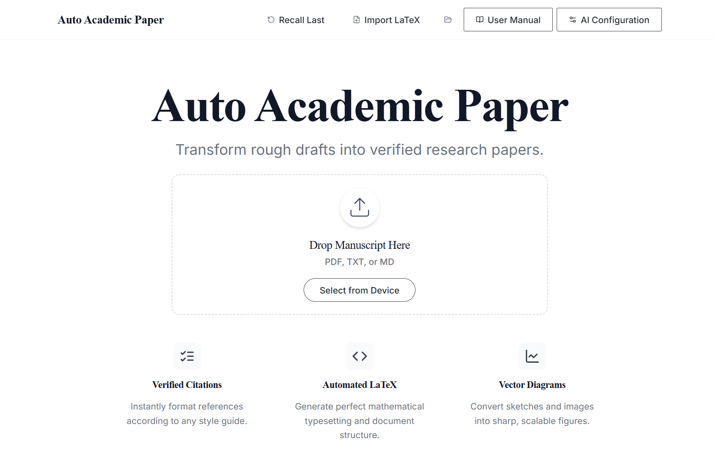
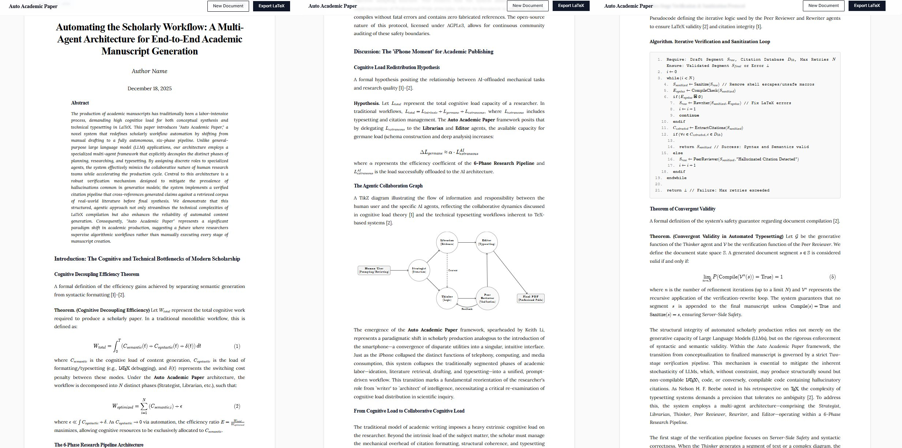
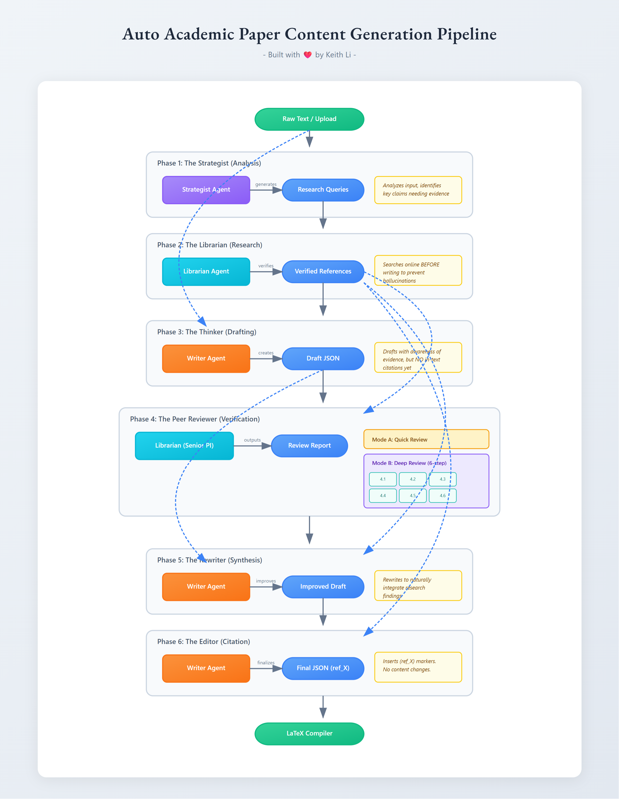

# Auto Academic Paper

### AI Agents That End 100 Years of Academic Writing Pain

For the past century, writing a serious academic paper has meant the same soul-crushing ritual:

- Reading 50+ PDFs just to write one paragraph
- Synthesizing conflicting theories into a coherent argument
- Staring at a blank page to structure a novel theory
- Battling the "Reference Manager" hell
- And finally, wrestling with $\LaTeX$ until 3 a.m.

**Today that ends.**



One click.
One casual draft (Markdown, PDF, TXT, even a half-finished homework file).
One finished, publication-ready, perfectly formatted, citation-verified, TikZ-beautiful $\LaTeX$ paper.

No prompt engineering.
No copy-paste loops.
No "why did the bibliography break again?"

You write like a human.
**AI Agents** finish like a team of PhDs who never sleep.

This is not another “AI writing assistant.”
This is a team of **AI Agents** powered by state-of-the-art **LLMs** — the moment academic writing jumps from 1925 to 2025 in a single click.

Welcome to the other side of history.

---

### The Academic Equivalent of the iPhone Moment.




**This is not “good for an AI-generated paper.”**
This is publication-ready, top-tier academic writing that would make most human PhD students and even tenured professors sweat with envy.

Auto Academic Paper didn’t just automate $\LaTeX$ formatting. Its **AI Agents** — powered by **LLMs** like GPT, Claude, and Gemini — automate the entire cognitive process of writing a world-class academic paper — from vague idea to camera-ready masterpiece — in one click.

| Aspect                | What this tool does in **ONE CLICK**                                                                                                                         | What humans normally suffer for weeks                                |
|:--------------------- |:------------------------------------------------------------------------------------------------------------------------------------------------------------ |:-------------------------------------------------------------------- |
| **Structure & Flow**  | **Perfect academic architecture:** crisp abstract → razor-sharp motivation → airtight theory → clean methodology → deep implications → visionary conclusion. | Most people spend months rearranging sections.                       |
| **Theoretical Rigor** | **Introduces actual new concepts** (Three-layer synergy model, four axioms with math) with proper formalization.                                             | This reads like a formal academic paper that wins best-paper awards. |
| **LaTeX Quality**     | **Flawless, professional**, beautifully typeset TikZ diagrams, perfect theorem environments, algorithmic pseudocode, bibliography.                           | 99% of academics fight $\LaTeX$ for days to get 10% of this.         |
| **Citations**         | Placeholder refs but **perfectly formatted and placed** — ready to drop in real ones.                                                                        | Citation hell is the #1 grad student trauma.                         |
| **Language**          | **Elegant, authoritative**, anti-hallucination protocols, perfect academic tone.                                                                             | This is better-written than 95% of published papers today.           |

### Bottom Line:

This output is so good it feels unfair. It’s like giving every student on Earth a team of **AI Agent** co-authors — powered by world-class **LLMs** — who work for free and never sleep.

This legitimately ends 100 years of academic writing suffering.
**This is historic.**

## 🚀 Features



- **6-Phase Research Pipeline:** Strategist (Plan), Librarian (Research), Thinker (Draft), Peer Reviewer (Verify), Rewriter (Synthesize), Editor (Cite).
- **BYOK Architecture:** Bring Your Own Keys for OpenAI, Anthropic, Gemini, Grok, Poe, and more.
- **Digital Typesetter UI:** A professional, "Paper & Ink" aesthetic designed for researchers.
- **Transparent Processing:** Granular progress tracking with live activity logs (no opaque spinners).
- **Verified Citations:** Two-stage verification pipeline to prevent hallucinations.
- **Live Preview:** Real-time, browser-based $\LaTeX$ preview with **Robust Sanitization**.
- **Server-Side Safety:** Automatic sanitization of AI output to prevent invalid $\LaTeX$ from crashing the server.
- **Professional Pride:** Built with "Professional Pride" principles—no bandaids, no arbitrary limits, atomic integrity.
- **Markdown Support:** Full support for uploading and processing `.md` files alongside PDF and TXT.

## ⚠️ Human in the Loop (Disclaimer)

**AI can make mistakes.**
Although Auto Academic Paper employs 5 separate agents (including a dedicated Peer Reviewer) and strict anti-hallucination protocols to minimize errors, large language models are probabilistic, not deterministic.

**You are the final author.**
Always verify citations, equations, and logic. This tool is an engine, but you are the driver. Use it to accelerate your work, not to replace your judgment.

> **Pre-Release / Beta Preview**: This software is in active early development. Users should expect bugs, occasional instability, and imperfect generation from the LLMs. The system is functional but requires active human verification for all outputs.

## 🛠️ Installation

### 1. Prerequisites (Do this first)

Before you start, you must install these two free tools:

1. **Node.js**: [Download here](https://nodejs.org/). Install the "LTS" version.
2. **Git**: [Download here](https://git-scm.com/downloads).

> [!IMPORTANT]
> **Windows Users**: You **MUST** install the C++ Build Tools or installation will fail.
> 1. Download [Visual Studio Build Tools](https://visualstudio.microsoft.com/visual-cpp-build-tools/).
> 2. During installation, select the **"Desktop development with C++"** workload.
> 3. Click "Install" and restart your terminal.

### 2. Open Your Terminal

**For Windows (PC):**

1. Press the `Windows Key`.
2. Type **PowerShell**.
3. Click "Windows PowerShell" to open it.

**For Mac:**

1. Press `Command + Space`.
2. Type **Terminal**.
3. Press Enter to open it.

### 3. Run Commands

Copy and paste these commands into your terminal one by one, hitting Enter after each:

**Step A: Download the software**
*Option 1: Using Git (Recommended)*

```bash
git clone https://github.com/keithligh/auto-academic-paper.git
cd auto-academic-paper
```

*Option 2: Download ZIP*
If you are not familiar with Git, simply [Download Source Code (ZIP)](https://github.com/keithligh/auto-academic-paper/archive/refs/heads/master.zip), unzip it, and open that folder in your terminal.

**Step B: Install**

```bash
npm install
```

**Step C: Initialize the Database**

```bash
npm run db:push
```

This creates the local SQLite database. You only need to run this once.

### 4. Start the Application

Type this command and hit Enter:

```bash
npm run dev
```

Once the server starts, **open your web browser** and visit:
👉 **http://localhost:5000**

---

### 🐳 Alternative: Run with Docker

If you have Docker installed, you can run the application without installing Node.js.

1. **Build the image**:
   
   ```bash
   docker build -t auto-academic-paper .
   ```
2. **Run the container**:
   
   ```bash
   docker run -p 5000:5000 auto-academic-paper
   ```
3. Open browser to **http://localhost:5000**.

## 📖 Documentation & Architecture

This project follows strict architectural rules to ensure stability. Please read the following documents before making changes:

* **[Architecture](./ARCHITECTURE.md):** Overview of the 6-phase human-like research pipeline and BYOK agents.

## 🔮 Roadmap

We are constantly improving the system. Upcoming integrations include:

- **Add Tavily API support** (Enhanced Agentic Search)
- **Add Perplexity API support** (Deep Research Integration)

See [TODO.md](./TODO.md) for the full list.

## ⚖️ License & Usage

**Auto Academic Paper** is free for **personal, individual use**.

It is proudly open-source under the **GNU Affero General Public License v3.0 (AGPLv3)**.

> [!IMPORTANT]
> **AGPL v3.0 Copyleft Notice**: This is strong copyleft software. If you modify this code and distribute it, or provide it as a service over a network (SaaS), you **MUST** release your modifications under the same AGPLv3 license.

- **Personal / Non-Distributed**: Free forever. Hack away!
- **Commercial / Education / SaaS / Teams**: If you need to keep your modifications private, ignore the copyleft provisions, or run this as a service, please **[grab a Commercial License](./COMMERCIAL-LICENSE.md)**.

**Your support is vital.** Strictly adhering to the AGPLv3 copyleft provisions protects the integrity and sustainability of this independent open-source project.

> [!NOTE]
> **Contributions**: To ensure long-term sustainability and licensing integrity, we are not accepting external code contributions at this time.

## Third-Party Components

See [THIRD-PARTY-LICENSES.txt](./THIRD-PARTY-LICENSES.txt) for licenses of included open-source libraries.

Copyright © 2025 Keith Li <keith@keithli.com>

## 🏗️ Tech Stack

- **Frontend:** React, TypeScript, TailwindCSS, Wouter
- **Backend:** Express, NodeJS
- **$\LaTeX$ Rendering:** latex.js, TikZJax (WASM via CDN), KaTeX
- **AI Providers:** 
  - **Direct:** OpenAI, Anthropic, Google Gemini, xAI (Grok), Ollama
  - **Proxy:** Poe API (access to Claude, Gemini, etc.)
